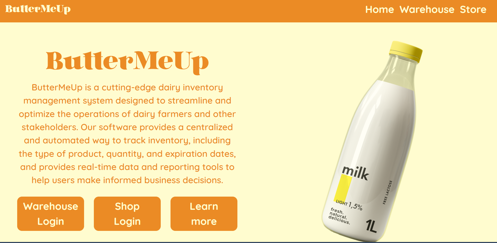
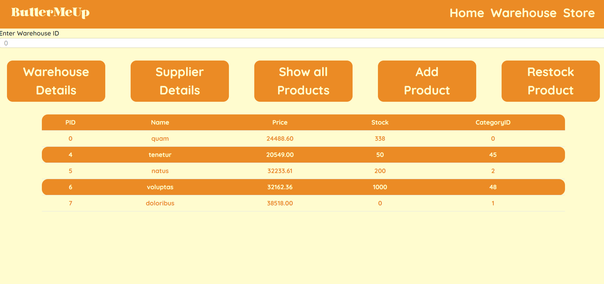
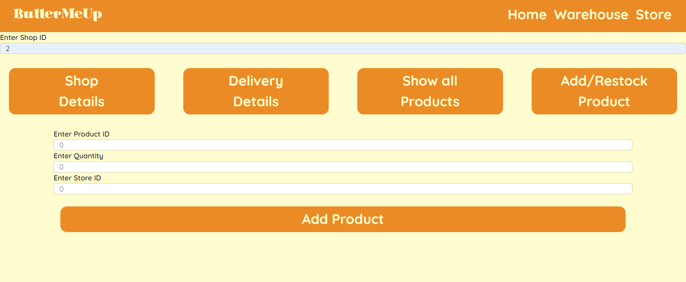
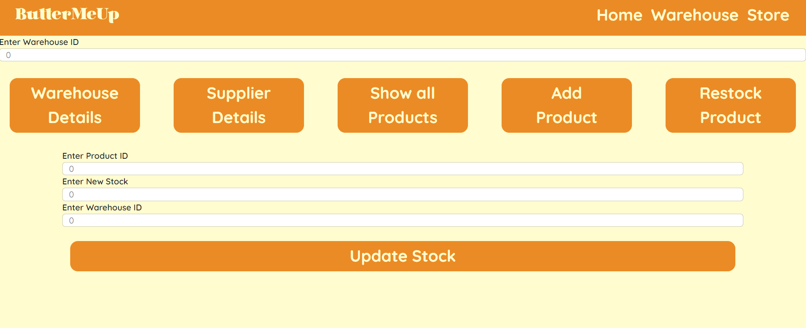

# ButterMeUp - Database Management System

## Overview
ButterMeUp is a Database Management System (DBMS) that provides a web interface for managing and querying databases. It offers an intuitive user interface for creating tables, inserting data, executing queries, and performing various operations on the database.

<h1> Relationship Schema </h1>
<ul>
  <li>Store(ST_ID, Sname, Address, Contact No., WarehouseID, D_ID, Price, Delivery Status)</li>
  <li>Product(PID, Pname, Price)</li>
  <li>Employee(EID, First Name, Last Name, Contact, Gender, StoreID)</li>
  <li>Customer(CID, First Name, Last Name, Contact)</li>
  <li>Supplier(SID, Sname, Contact No., Address, ProductID)</li>
  <li>Warehouse(WID, Wname, Address, SupplierID, Quantity)</li>
  <li>Stores1(Stock, PID, WID)</li>
  <li>Stores2(Stock, PID, ST_ID)</li>
  <li>Sells to(Order Total, CID, ST_ID)</li>
  <li>Employee Phone(Phone Number, E_ID)</li>
  <li>Customer Phone(Phone Number, CID)</li>
  <li>Store Phone(ST_ID, Phone Number)</li>
  <li>Warehouse Phone(WID, Phone Number)</li>
  <li>Supplier Phone(SID, Phone Number)</li>
  <li>Customer Review(CID, Review)</li>
  <li>Delivers_to(D_ID, Price, Delivery_Status, WID, ST_ID)</li>
</ul>

## Features
- User-friendly web interface for managing databases
- Create and manage database tables
- Insert, update, and delete data

## Technologies Used
- Programming Language: Python
- Web Framework: Django
- Database: PostgreSQL
- Frontend: HTML, CSS, JavaScript

## Screenshots

