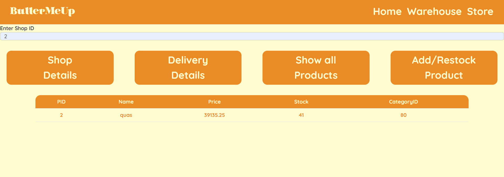

<h1>ButterMeUp - Database Management System</h1> project by Nayan Dwivedi 2021402 and Siddhant Khokhar

## Overview
ButterMeUp is a cutting-edge dairy inventory management system designed to streamline and optimize the
operations of dairy farmers and other stakeholders. Our software provides a centralized and automated way to
track inventory, including the type of product and quantity. It provides real-time data and
reporting tools to help users make informed business decisions.

## Features
- User-friendly web interface for managing databases
- Create and manage database tables
- Insert, update, and delete data

## Technologies Used
- Database: MySQL
- Frontend: HTML, CSS, JavaScript, React
- Backend: React
- Axios: A JavaScript library, simplifies data exchange between the frontend and backend. It provides an intuitive API for making asynchronous HTTP requests. 
With Axios, data retrieval and UI updates become effortless.
- Express: A web application framework for Node.js, powers the backend. It handles incoming HTTP requests and generates corresponding responses. Express simplifies route definition, middleware handling, and response management. It allows for easy creation of a RESTful API.
- CORS (Cross-Origin Resource Sharing): A mechanism enabled by the CORS middleware package in Express.js, ensures secure cross-origin communication. By managing HTTP headers, CORS allows the frontend, running on a different origin, to make requests to the backend server. It facilitates seamless communication between frontend and backend.

## Installation Instructions
1. Clone the repository: git clone https://github.com/yourusername/buttermeup.git
2. Navigate to the project directory: cd buttermeup
3. Create a MySQL database named "ButterMeUp" by executing the SQL files located in the Database_creation folder.
4. Set up the MySQL database connection parameters in your backend code. Open the backend file (backend/index.js) and locate the db configuration object. Update the host, user, password, and database fields to match your MySQL database configuration.
5. Install the required dependencies: Run npm install to install the necessary Node.js dependencies for the project.

## Usage Guide
1. Run the index.js file in the backend folder to connect to the database, you should see "Connected to backend!" message in the command line upon successful connection.
2. Navigate to the frontend directory and run npm start in the command line. Upon successful compilation the interface will open up in your default internet browser.
3. You can interact with the frontend components and make HTTP requests to the backend API to perform various database operations.

## Relationship Schema 
<ul>
  <li>Store(ST_ID, Sname, Address, Contact No., WarehouseID, D_ID, Price, Delivery Status)</li>
  <li>Product(PID, Pname, Price)</li>
  <li>Employee(EID, First Name, Last Name, Contact, Gender, StoreID)</li>
  <li>Customer(CID, First Name, Last Name, Contact)</li>
  <li>Supplier(SID, Sname, Contact No., Address, ProductID)</li>
  <li>Warehouse(WID, Wname, Address, SupplierID, Quantity)</li>
  <li>Stores1(Stock, PID, WID)</li>
  <li>Stores2(Stock, PID, ST_ID)</li>
  <li>Sells to(Order Total, CID, ST_ID)</li>
  <li>Employee Phone(Phone Number, E_ID)</li>
  <li>Customer Phone(Phone Number, CID)</li>
  <li>Store Phone(ST_ID, Phone Number)</li>
  <li>Warehouse Phone(WID, Phone Number)</li>
  <li>Supplier Phone(SID, Phone Number)</li>
  <li>Customer Review(CID, Review)</li>
  <li>Delivers_to(D_ID, Price, Delivery_Status, WID, ST_ID)</li>
</ul>

## ER Diagram

## Screenshots

1. Warehouse Login:
   - The "Warehouse Login" button redirects to a login page for warehouse managers.
   - Warehouse managers can input their credentials to log in.

2. Shop Login:
   - The "Shop Login" button redirects users to a login page designed for employees.
   

Warehouse Page:
   - The Warehouse page features an input field where users can enter the warehouse ID to access relevant data.
   - Users can add a product to a warehouse by entering the Product ID and the quantity of the product.
   - Users can restock products by entering the Product ID, updated stock, and the Warehouse ID.
   - Image: 
   - 

Shop Page:
   - Shopkeepers who log in will be redirected to the Shop Page.
   - They can click on relevant buttons to access information about their shop.
   - They can restock products by entering the Product ID, quantity, and Store ID.
   - Image: 
   - 

